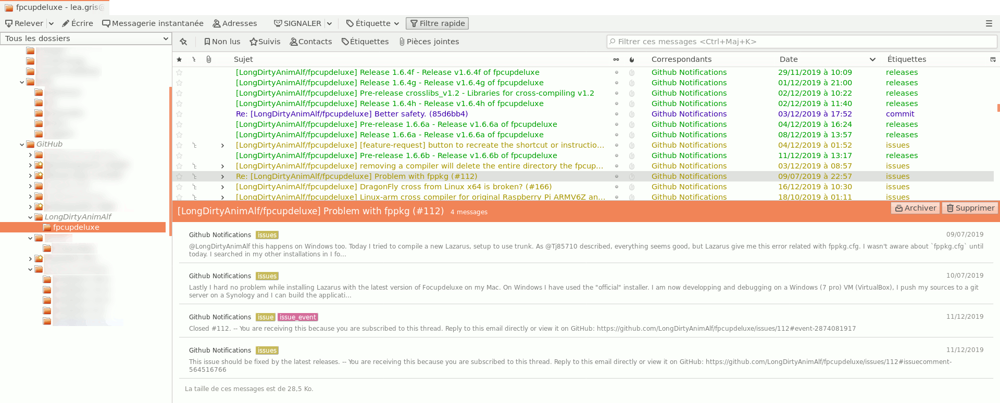

# GitHubSieve

## Sieve Mail Filtering and Tagging for GitHub Notifications

If you are a subscriber, member, or owner of one or more GitHub repositories, you might receive a dense flow of email notifications, which can be a source of mental overload and attention disruption. However, if all those notifications arrived already organised and tagged in your mailbox, it could greatly improve your focus on important topics.

**GitHubSieve** is a [Sieve filter](https://en.wikipedia.org/wiki/Sieve_(mail_filtering_language)) designed to do exactly this for you.



### Requirements

#### Essential

To use GitHubSieve, you need an email service that supports Sieve filtering and allows you to edit or upload your own Sieve filter.

#### Recommended

Server-side filtering is best suited for folder-based access to your mailbox. This can be achieved either via an IMAP mail client or a feature-rich webmail service.

#### Optimal Experience

For the best overall experience, use Mozilla Thunderbird or Betterbird mail clients, which support the full set of standard IMAP tags (named and system tags).

### Customisation

Open `github.sieve` in a text editor and modify line 5 to match your desired folder structure for GitHub notifications:

```sieve
# Change this to your liking: Sets the root folder for GitHub notifications' emails
set "ghFolder" "Lists/GitHub";
```

This default setting will move GitHub notification messages. It will start at the folder `Lists/GitHub`, then use the GitHub repository owner's name as the next folder name, and finally store the messages in a sub-folder named after the GitHub repository itself.
